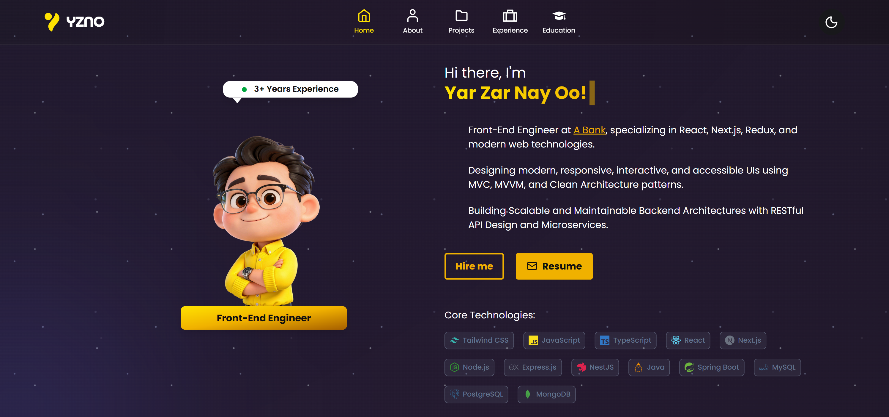
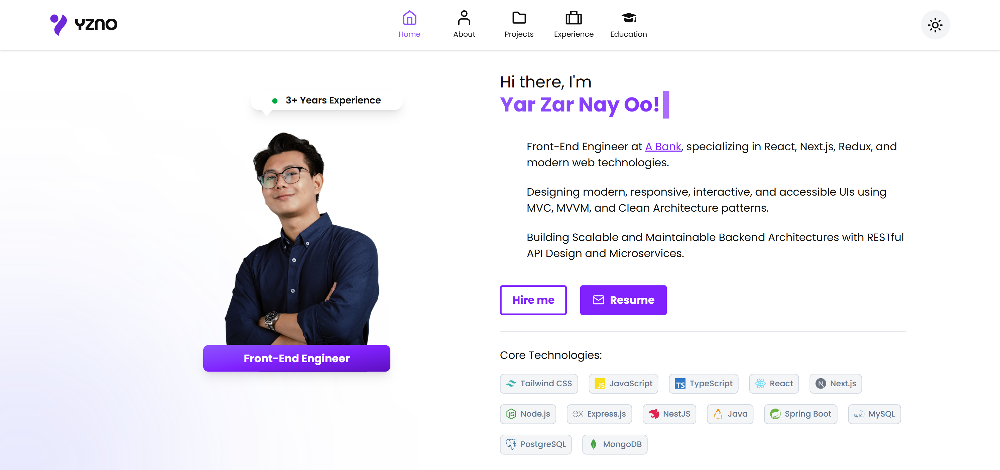

<div align="center">

  <h2 align="center">YZNO Portfolio Website</h2>
  
  <p align="center">
  
  </p>

  <p align="center">
  
  </p>

  <br>

  <div>
    
    
    
  </div>
</div>

## 📋 <a name="table">Table of Contents</a>

1. 🤖 [Introduction](#introduction)
2. ⚙️ [Tech Stack](#tech-stack)
3. 🔋 [Features](#features)
4. 🚀 [Quick Start](#quick-start)

## <a name="introduction">🤖 Introduction</a>

This portfolio is a modern and responsive personal website developed using React.js and Tailwind CSS. It showcases my projects, technical skills, and professional experience with a focus on clean design and smooth user experience. The website incorporates modern UI/UX principles, responsive layouts, and subtle animations to create an engaging and visually appealing interface. It also demonstrates my ability to build scalable front-end applications using component-based architecture and modern development practices. This project was created to present my work, highlight my development skills, and serve as a central place where recruiters can explore my projects and experience.

## <a name="tech-stack">⚙️ Tech Stack</a>

- **[React](https://react.dev/)** is a declarative JavaScript library for building interactive UIs. It provides the component structure for modular development and support for responsive layout.

- **[Vite](https://vitejs.dev/)** is a lightning-fast build tool and development server that powers this project’s workflow. It enables instant hot module replacement, fast startup, and optimized production builds—ideal for an animation-heavy React site with smooth, real-time development feedback and minimal config.

- **[Tailwind CSS](https://tailwindcss.com/)** is a utility-first CSS framework that allows developers to design custom user interfaces by applying low-level utility classes directly in HTML, streamlining the design process.

- **[GSAP](https://gsap.com/)** is a powerful JavaScript animation library used in this project to create dynamic, scroll-driven visuals.

## <a name="features">🔋 Features</a>

- **Stunning Sections**: Includes hero, about, projects, experience, education, and contact sections.

- **Dynamic Theming**: Implemented light and dark themes using React Context API with smooth UI consistency across all sections.

- **Seamless Navigation**: Offers a smooth user experience with intuitive navigation and scrolling.

- **ScrollTrigger Effects**: Power scroll-based animations and timeline control with GSAP’s ScrollTrigger.

- **Project Showcase Slider**: Interactive slider to showcase featured projects with smooth transitions.

- **Contact Mailbox**: Integrated contact form for users to send messages directly from the website.

- **Optimized Performance**: Built for fast loading and an optimized experience.

- **Pixel Perfect Design**: Ensures flawless responsiveness across all devices and screen sizes.

## <a name="quick-start">🚀 Quick Start</a>

Follow these steps to set up the project locally on your machine.

**Prerequisites**

Make sure you have the following installed on your machine:

- [Git](https://git-scm.com/)
- [Node.js](https://nodejs.org/en)
- [npm (Node Package Manager)](https://www.npmjs.com/)

**Cloning the Repository**

```bash
git clone https://github.com/yarzarnayoo27/yzno-portfolio.git
cd yzno-portfolio
```

**Installation**

Install the project dependencies using npm:

```bash
npm install
```

**Running the Project**

```bash
npm run dev
```

Open [http://localhost:5173](http://localhost:5173) in your browser to view the project.
